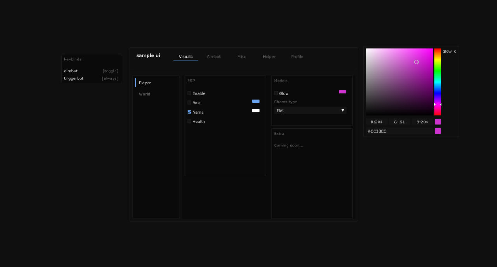

# IMGui DX9 Sample Menu

Simple ImGui DX9 menu just for fun



## Requirements
* C++20 compiler
* CMake (3.16+)
* Ninja build system

## Build
```cmd
cmake -B build -G "Ninja"
cmake --build build --config Releas
```
The output binary `Imgui_DX9_Sample_UI.exe` will appear in the `build/` directory.
